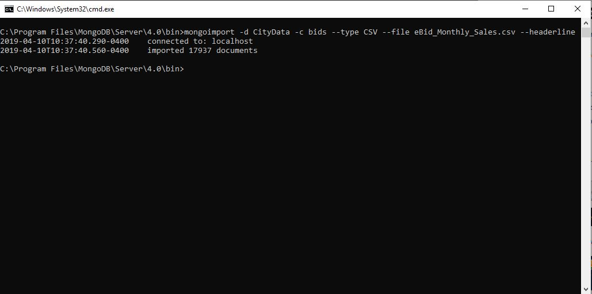

# Final-Project
For my capstone at SNHU for my CS degree I will be converting a previous project from C++ to python.
The project takes in two csv files that are sorted and then placed into a binary search tree data structure.
From there, the user can display each entry of data sorted by ID number in ascending order. 
The user is also able to search for one entry with by entering the ID number associated with the entry.

## Dependencies
Project is currently using Python 3.7.0 32-bit
Project is currently using MongoDB server version: 4.0.8
Project is currently using MongoDB shell version v4.0.8

## Installation and setup for MongoDB
MongoDB server and shell can be downloaded and installed from [here](https://docs.mongodb.com/manual/tutorial/install-mongodb-on-windows/#install-mdb-edition)

Follow the instructions to download the MongoDB Community Edition.
It is recommended that you place the MongoDB install in C:\Program Files\ and that you create the database directory at C:\ and create a directory "\data\db"

The current version of Python code starts the mongod.exe when you launch the main_menu.py. The main_menu.py also kills the mongod.exe server at the exiting of the program.

### mongoimport
* Copy the eBid_Monthly_Sales.csv to the bin folder that the mongod.exe is located. 
* Launch a cmd window and navigate to the file location of the eBid_Monthly_Sales.csv
* enter the command '''mongoimport -d CityData -c bids --type CSV --file eBid_Monthly_Sales.csv --headerline'''

